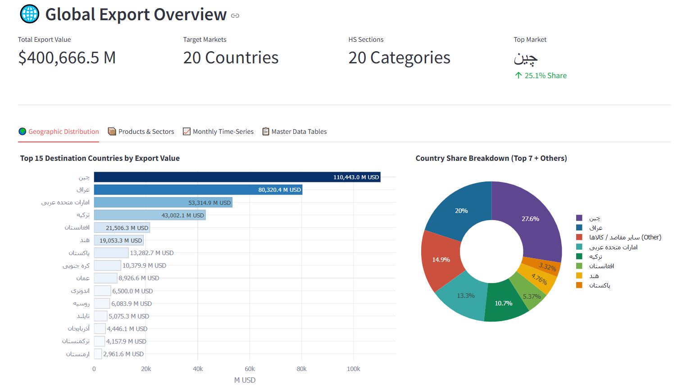
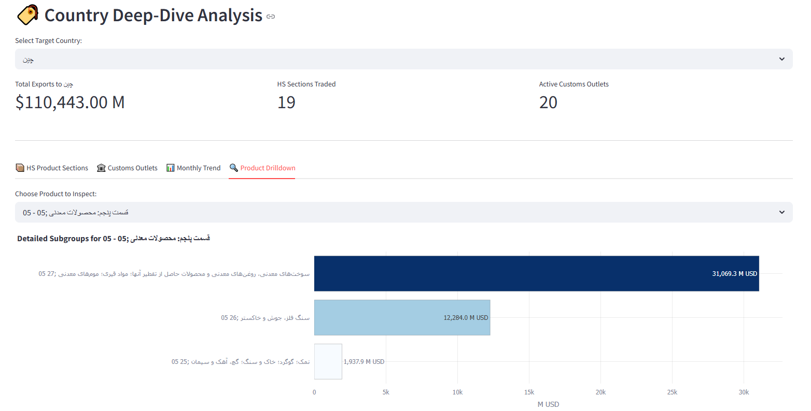
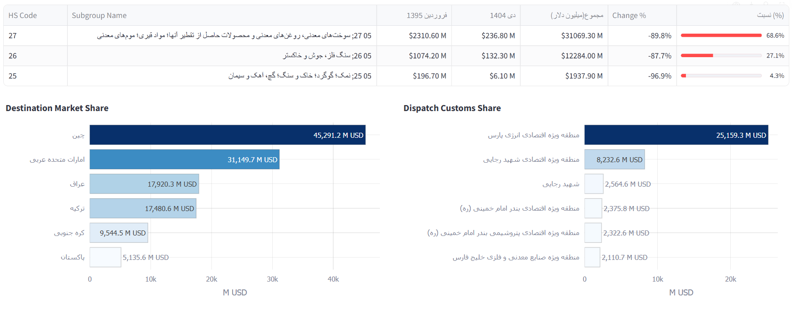
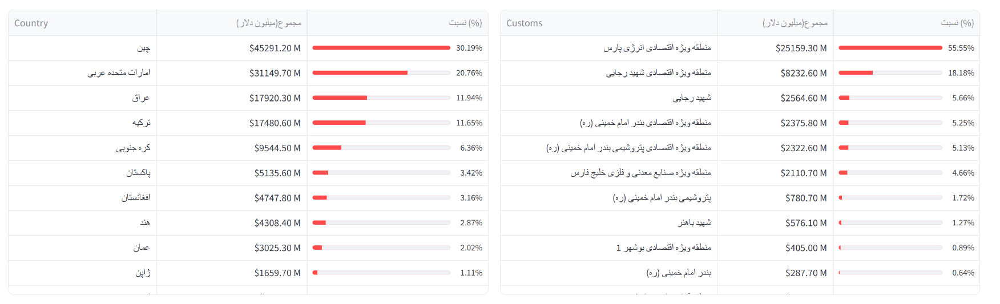

<div align="center">
  
#  Iran Trade Export Analytics Dashboard

[](#)
[](#)
[](#)
[](#)

An end-to-end analytics platform that scrapes, processes, stores, and visualizes bilateral export trade data from [ir-trades.com](https://ir-trades.com). 

</div>

##  Table of Contents
* [Dashboard Previews](#-dashboard-previews)
* [Key Features](#-key-features)
* [Architecture & Tech Stack](#-architecture--tech-stack)
* [Project Structure](#-project-structure)
* [Getting Started](#-getting-started)
* [Database Schema Summary](#-database-schema-summary)

---

##  Dashboard Previews

### Global Export Overview

> *High-level KPIs, top destination rankings, market share donut charts, and global distribution treemaps.*

### Country Deep-Dive Analysis

> *Granular analysis filtering by destination country to analyze specific HS section shares and export metrics.*

### Product & Subgroup Drilldown

> *Detailed subgroup data tables alongside destination market and dispatch customs share charts.*

### Master Data Tables

> *Clean, sortable data tables for destination countries and customs checkpoints.*

---

##  Key Features

* **Automated Asynchronous Scraper:** Built with Playwright to reliably extract data from dynamic Blazor Server SPAs using state polling and retry mechanisms.
* **Robust Text & Numeric Sanitization:** Normalizes Persian/Arabic numerals, removes non-printing RTL directional markers (`\u202b`), and calculates period-over-period percentage shifts.
* **Relational Data Storage:** Normalized SQLite schema indexing global metrics, target destination countries, active customs offices, and HS product code hierarchies.
* **Interactive Visualization:** Powered by Streamlit and Plotly for responsive charting and real-time filtering without translation latency.

---

##  Architecture & Tech Stack

```text
[ ir-trades.com (Blazor) ]
           │
           ▼  (Playwright Async)
     scraper.py
           │
           ▼  (BeautifulSoup + Pandas)
      parser.py
           │
           ▼  (SQL DDL / Schema)
     exports.db (SQLite)
           │
           ▼  (Streamlit + Plotly)
        app.py
```

Frontend / Visualization: Streamlit, Plotly Express & Graph Objects

Web Scraping: Playwright Async API, BeautifulSoup4

Data Engineering: Pandas, SQLite3

Runtime: Python 3.10+


## Getting Started
1. Clone the Repository
```Bash
git clone [https://github.com/ParsaYousefnezhad/iran-trade-export-dashboard.git](https://github.com/ParsaYousefnezhad/iran-trade-export-dashboard.git)
cd iran-trade-export-dashboard
```
2. Set Up Virtual Environment & Dependencies
```
Bash
python -m venv venv

# Windows:
venv\Scripts\activate
# macOS/Linux:
source venv/bin/activate

pip install -r requirements.txt
playwright install chromium
```
3. Collect Data
Run the scraping pipeline to extract the latest trade data and populate the local SQLite database (exports.db):
```
Bash
python -m collector.scraper
```

4. Launch the Dashboard
```
Bash
streamlit run app.py
```
## Database Schema Summary
metadata: Tracks global time intervals and scraping timestamps.

countries: Destination countries, aggregated trade values, and market share percentages.

customs: Outbound customs checkpoints and throughput.

hs_sections: Standardized Harmonized System chapters and product groupings.

country_hs & country_customs: Country-level commodity and customs mappings.

monthly_price & monthly_weight: Multi-year time-series records.

product_subgroups: Sub-tier tariff code distributions for deep-dive inspections.
